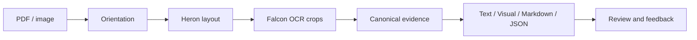

# Not So Smart OCR

**Document extraction you can inspect.**

Text · Tables · Handwriting · Formulas · Source-linked review

[Examples](#examples) · [Pipeline](#pipeline) · [Walkthroughs](#walkthroughs)

## Features

- Extract text and structure from PDFs and images.
- Inspect colored layout boxes and download full-resolution source crops.
- Review formulas, tables, images, and detected checkbox states.
- Explore text, visual, Markdown, and JSON views of the same evidence.
- Save feedback with its image and result, retaining 1,000 records locally.

## Examples

| Type | Example | View |
| --- | --- | --- |
| Paper | Attention Is All You Need | [Output](artifacts/demo/paper-ui.png) |
| Handwriting and math | Physics notes | [Output](artifacts/demo/notes-ui.png) |
| Printed math | Scanned calculus formulas | [Output](artifacts/demo/printed-math-ui.png) |
| Tables | Public financial report | [Output](artifacts/demo/table-ui.png) |
| Screenshot | GSoC Final Evaluation | [Output](artifacts/demo/gsoc-ui.png) |

| Academic layout | Handwritten formulas |
| --- | --- |
|  |  |
| **Text and images** | **Printed mathematics** |
|  |  |

Screenshots show actual output, including errors. Overlapping regions can still produce duplicates; handwriting, numeric fields, and reading order remain imperfect. Model scores are uncalibrated. Private documents and datasets are excluded.

## Pipeline

The configuration verified on 13 September 2026 uses DocTR and Tesseract OSD for orientation, Heron layout inside the native Falcon server, and complete-region Falcon OCR. It retains source pixels and canonical evidence, with local KaTeX for math. An additional app-level Heron proposal pass, TableFormer, Nemotron, and external crop refinement are optional and inactive in this configuration. The demo composition endpoint reports the configuration of each running service.

## Walkthroughs

Walkthroughs grounded in the code, technical reports, and measured runs:

| Read | Covers |
| --- | --- |
| [From pixels to text](docs/walkthroughs/01-from-image-to-text.md) | The running pipeline and model choices |
| [Layout, tables, and Falcon contributions](docs/walkthroughs/02-layout-tables-and-crops.md) | Geometry, crops, duplicates, and upstream fixes |
| [Confidence, Markdown, and review](docs/walkthroughs/03-confidence-exports-and-review.md) | Token scores, rendering, exports, and feedback |
| [Model internals and hardware](docs/walkthroughs/04-model-internals-and-hardware.md) | DETR, orientation, table recognition, and VRAM |
| [Inside Falcon-OCR](docs/walkthroughs/05-falcon-technical-report.md) | Early fusion, attention, training, and native serving |
| [Document-parsing strategies](docs/walkthroughs/06-document-parsing-strategies.md) | Seven OCR systems and their architectural trade-offs |
| [From research to implementation](docs/walkthroughs/07-research-to-implementation.md) | What we reused, what each paper taught us, and observed improvements |
| [Fidelity repairs and routing results](docs/walkthroughs/08-fidelity-and-routing.md) | Current runtime, preserved table content, paired Qwen comparison, and remaining failures |

**Hardware:** exercised on a 24 GB-class NVIDIA A10G. Minimum VRAM is not established; see the [memory breakdown](docs/walkthroughs/04-model-internals-and-hardware.md#vram-and-performance).

## Acknowledgements

Thank you to the teams behind [Falcon-Perception](https://github.com/tiiuae/Falcon-Perception), [IBM's Heron layout model](https://huggingface.co/docling-project/docling-layout-heron-101), [DocTR](https://github.com/mindee/doctr), [Tesseract](https://github.com/tesseract-ocr/tesseract), [Poppler](https://gitlab.freedesktop.org/poppler/poppler), and [KaTeX](https://github.com/KaTeX/KaTeX). Heron comes from the Docling project. Their respective licenses apply.
